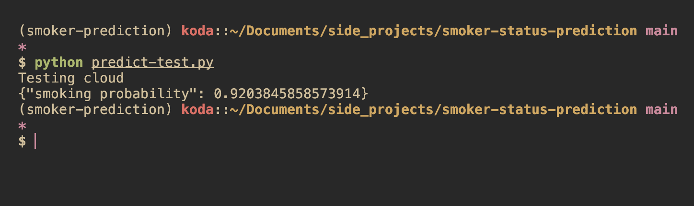

# Binary Prediction of Smoker Status

## Problem Description

The goal of this project is to create a machine learning model to predict a patient's smoking status using various bio-signals. This is part of a [Kaggle Playground Series Competition](https://www.kaggle.com/competitions/playground-series-s3e24). Our model will output the **probability** that a given patient smokes. We will evaluate the model's performance on area under the ROC curve using Stratified KFold validation.

### Background

Smoking's well-established adverse effects on health are unquestionable, making it a leading cause of preventable global morbidity and mortality by 2018. A World Health Organization report forecasts that smoking-related deaths will reach 10 million by 2030. Although evidence-based smoking cessation strategies have been advocated, their success remains limited, with traditional counseling often considered ineffective and time-consuming. To address this, various factors have been proposed to predict an individual's likelihood of quitting, but their application yields inconsistent results. A solution lies in developing predictive models using machine learning techniques, a promising approach in recent years for understanding an individual's chances of quitting smoking and improving public health outcomes.

## Data

We will be combining 2 datasets for this project.

1. [Kaggle Competition Data](https://www.kaggle.com/competitions/playground-series-s3e24/data): This data was provided by Kaggle for the competition and was **synthetically generated** using a deep learning model. The deep learning model was trained using the data from the second dataset. It contains a train and test set, where the target column `smoking` is missing from the test set.
2. [Body signal of smoking](https://www.kaggle.com/datasets/kukuroo3/body-signal-of-smoking/data): This data was used to train the deep learning model which generated the data in the first dataset. I will be using this dataset to increase the size of the my training set. Hopefully, this will improve my model's performance.

### Feature Descriptions

| Name | Description |
| ---- | ----------- |
| **Age** | Age of patient, **grouped by 5-year increments** |
| **Height** | Height of patient, **grouped by 5-cm increments** |
| **Weight** | Weight of patient, **grouped by 5-kg increments** |
| **Waist** | Waist circumference in cm|
| **Eyesight (left)** | Visual acuity in left eye from 0.1 to 2.0 (higher is better), where 1.0 is equivalent to 20/20, **blindness is 9.9** |
| **Eyesight (right)** | Visual acuity in right eye from 0.1 to 2.0 (higher is better), where 1.0 is equivalent to 20/20, **blindness is 9.9** |
| **Hearing (left)** | Hearing in left ear where 1=normal, 2=abnormal |
| **Hearing (right)** | Hearing in right ear where 1=normal, 2=abnormal |
| **Systolic** | Blood pressure, amount of pressure experienced by the arteries when the heart is contracting |
| **Relaxation** | Blood pressure (diastolic), amount of pressure experienced by the arteries when the heart is relaxing |
| **Fasting Blood Sugar** | Blood sugar level (concentration per 100ml of blood) before eating |
| **Cholesterol** | Sum of ester-type and non-ester-type cholesterol |
| **Triglyceride** | Amount of simple and neutral lipids in blood |
| **HDL** | High Density Lipoprotein, "good" cholesterol, absorbs cholesterol in the blood and carries it back to the liver |
| **LDL** | Low Density Lipoprotein, "bad" cholesterol, makes up most of body's cholesterol. High levels of this raise risk for heart disease and stroke. |
| **Hemoglobin** | Protein contained in red blood cells that delivers oxygen to the tissues |
| **Urine Protein** | Amount of protein mixed in urine |
| **Serum Creatinine** | Creatine level, Creatinine is a waste product in your blood that comes from your muscles. Healthy kidneys filter creatinine out of your blood through your urine. |
| **AST** | Aspartate transaminase, an enzyme that helps the body break down amino acids. It's usually present in blood at low levels. An increase in AST levels may mean liver damage, liver disease or muscle damage. |
| **ALT** | Alanine transaminase, an enzyme found in the liver that helps convert proteins into energy for the liver cells. When the liver is damaged, ALT is released into the bloodstream and levels increase. |
| **GTP** | Gamma-glutamyltransferase (GGT), an enzyme in the blood. Higher-than-usual levels may mean liver or bile duct damage. |
| **Dental Caries** | Cavities, 0=absent, 1=present |
| **Smoking** | 0=non-smoker, 1=smoker |

## Usage

### Local Environment Setup

Here your environment can be set up to run the notebook & code locally.

1. Ensure [miniconda/anaconda](https://conda.io/projects/conda/en/latest/user-guide/install/index.html) is installed.

2. Create the conda environment.

  ```bash
  conda env create -f environment.yaml
  ```

3. Activate environment.

  ```bash
  conda activate smoker-prediction
  ```

4. Install dependencies with poetry.

```bash
poetry install
```

### Docker & Local Testing

1. Ensure you have Docker installed.
2. Build the image

```bash
docker build -t smoker-prediction .
```

3. Run the image

```bash
docker run -it- rm -p 9696:9696 smoker-prediction
```

4. Test the service locally

```bash
python predict-test.py --local
```

### Deployment & Cloud Testing

- The model was deployed to AWS Elastic Beanstalk
- URL deployed to: smoking-serving-env.eba-rfk3vyqz.us-west-1.elasticbeanstalk.com
- To test the service running in the cloud run:

```bash
python predict-test.py
```



#### Deploying the model yourself

If you want to deploy the model with elastic beanstalk yourself, you can follow the steps below

1. Create an AWS IAM account to use for this project.
2. Set up access keys
3. Initialize the elastic beanstalk environment

```bash
eb init -p "Docker running on 64bit Amazon Linux 2023" smoking-serving -r <your-region>
```

4. Test locally

```bash
eb local run --port 9696
```

5. Deploy to cloud

```bash
eb create smoking-serving-env -i t3.small --timeout 10
```

## Deliverables

- [x] `README.md` with
  - [x] Description of the problem
  - [x] Instructions on how to run the project
- [x] Data
  - [x] You should either commit the dataset you used or have clear instructions how to download the dataset
- [x] Notebook (suggested name - `notebook.ipynb`) with
  - [x] Data preparation and data clearning
  - [x] EDA (ranges of values, missing values, analysis of target variable, feature importance analysis)
  - [x] Model selection process and parameter tuning
- [x] Script `train.py` (suggested name)
  - [x] Training the final model
  - [x] Saving it to a file (e.g. pickle) or saving it with specialized software (BentoML)
- [x] Script `predict.py` (suggested name)
  - [x] Loading the model
  - [x] Serving it via a web serice (with Flask or specialized sofware - BentoML, KServe, etc)
- [x] Files with dependencies
  - [x] `Pipenv` and `Pipenv.lock` if you use Pipenv
  - [x] or equivalents: conda environment file, requirements.txt or pyproject.toml
- [x] `Dockerfile` for running the service
- [x] Deployment
  - [x] URL to the service you deployed or
  - [x] Video or image of how you interact with the deployed service

## Future Work

- The original dataset cites its source as the [Korean Government](https://www.data.go.kr/data/15007122/fileData.do#/tab-layer-file). It appears that additional data can be downloaded here. Since the competition dataset was synthetically generated, will using additional real-world data sources improve accuracy on the competition test set?
